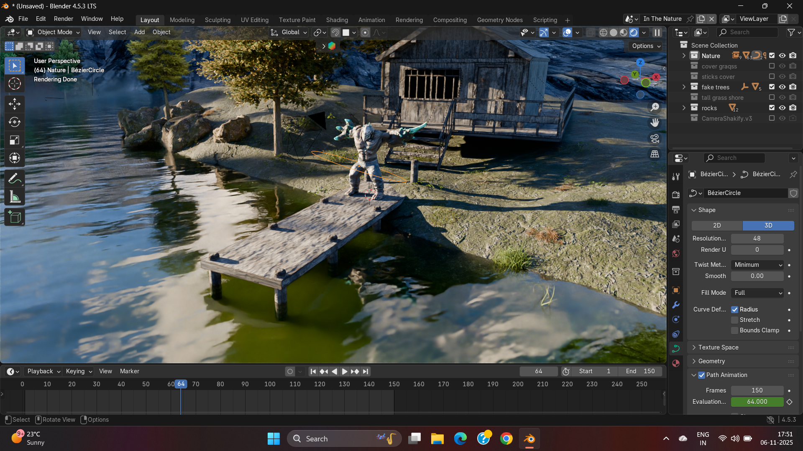
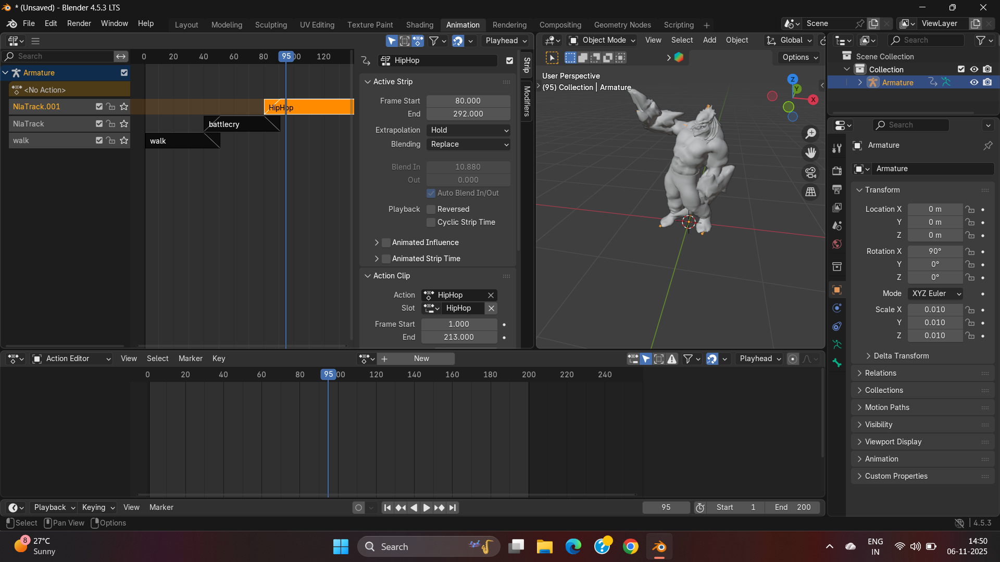
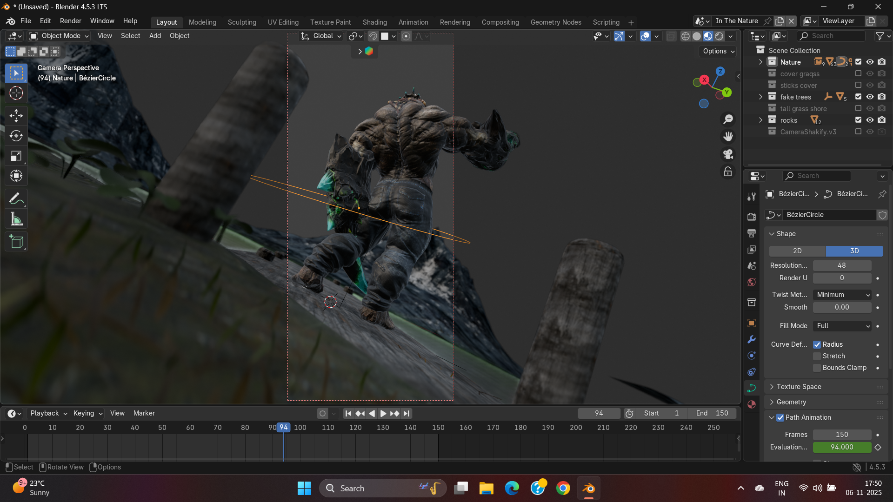

# Dancing Mutant: 3D Character Animation

## 🎥 Project Demo
https://github.com/user-attachments/assets/a4e2ae86-91eb-4c1d-a463-1935126b195c

## 📝 Project Overview
This project focuses on the full 3D character pipeline, taking a "Mutant" concept from rigging to final animation. The goal was to create a fluid dance cycle that tests complex mesh deformations and texture consistency under movement.

**Tools Used:**
* **Blender 4.0** (Cycles Render)
* **Rigify** (Skeleton & Weight Painting)

---

## ⚙️ The Workflow

### 1. Animation & Rigging
Focusing on weight painting to ensure the mutant's unique anatomy deforms correctly during the dance cycle.

### 2. Texturing & Shading
Using procedural shaders to create the mutant skin details.

---

## 📥 Project Files
You can download the source files to explore the rig and shader setup.

* **[Download Project Source (.zip)](mutant_project_source.zip)**
